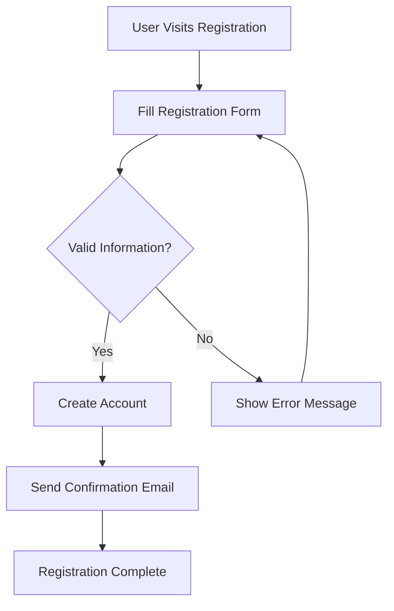
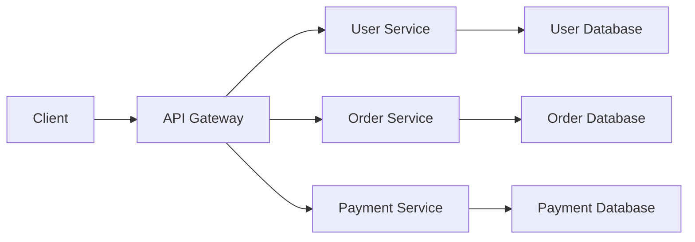
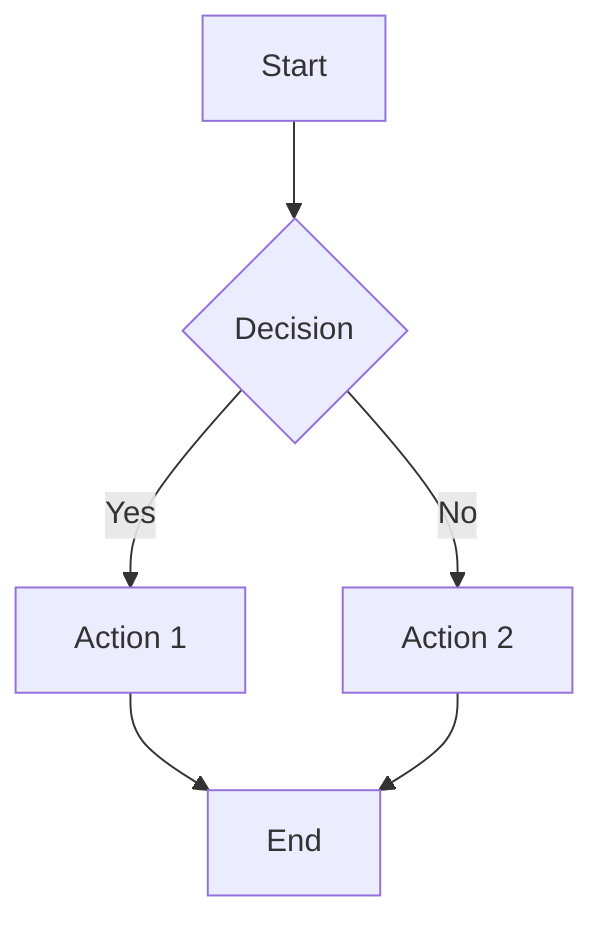

# Merlin - AI-Powered Mermaid Diagram Generator

**Merlin** is an intelligent diagram generation tool that combines the power of Large Language Models (LLMs) with Mermaid.js to create beautiful, interactive diagrams from natural language descriptions.


## ✨ Features

- **AI-Powered Generation**: Describe your diagram in plain English and let AI generate the Mermaid code
- **Real-time Preview**: See your diagrams rendered instantly as you type
- **Direct Code Editing**: Edit Mermaid syntax directly with syntax highlighting
- **Multiple Diagram Types**: Support for flowcharts, sequence diagrams, class diagrams, and more
- **Example Templates**: Quick-start with pre-built diagram examples
- **Modern UI**: Clean, dark-themed interface with responsive design
- **Fast Performance**: Built with Next.js 15 and Turbopack for lightning-fast development

## 🎯 Use Cases

- **Software Architecture**: Create system diagrams, flowcharts, and process flows
- **Documentation**: Generate visual documentation for your projects
- **Education**: Create learning materials with clear visual representations
- **Business Process**: Map out workflows and decision trees
- **Project Planning**: Visualize project structures and dependencies

## 🚀 Quick Start

### Prerequisites

Before you begin, ensure you have the following installed:

- **Node.js** (v18 or higher)
- **npm**, **yarn**, **pnpm**, or **bun**
- **Ollama** (for AI diagram generation)

### Setting up Ollama

1. Install Ollama from [ollama.com](https://ollama.com/)
2. Pull the required model:
   ```bash
   ollama pull gemma3:4b
   ```
3. Start the Ollama service:
   ```bash
   ollama serve
   ```

### Installation

1. Clone the repository:
   ```bash
   git clone https://github.com/nani-samireddy/merlin.git
   cd merlin
   ```

2. Install dependencies:
   ```bash
   npm install
   # or
   yarn install
   # or
   pnpm install
   ```

3. Start the development server:
   ```bash
   npm run dev
   # or
   yarn dev
   # or
   pnpm dev
   ```

4. Open [http://localhost:3000](http://localhost:3000) in your browser

## 📖 Usage Examples

### Example 1: Simple Flowchart

**Natural Language Input:**
```
Create a user registration process flowchart
```

**Generated Mermaid Code:**


### Example 2: System Architecture

**Natural Language Input:**
```
Show a microservices architecture with API gateway, user service, and database
```

**Generated Output:**


### Example 3: Direct Code Editing

You can also write Mermaid code directly:



## ⚙️ Configuration

### LLM Provider Configuration

The application currently supports Ollama as the LLM provider. You can configure it in:

```typescript
// app/api/generate/route.ts
const {
    prompt,
    provider = "ollama",
    options = { model: "gemma3:4b" },
} = await req.json();
```

### Available Models

- `gemma3:4b` (default) - Balanced performance and quality
- `llama3.2` - Alternative model option
- `codellama` - Optimized for code generation

### Environment Variables

Create a `.env.local` file for custom configurations:

```env
# Ollama Configuration
OLLAMA_BASE_URL=http://localhost:11434
DEFAULT_MODEL=gemma3:4b
```

## 🛠️ Development

### Project Structure

```
merlin/
├── app/                    # Next.js app directory
│   ├── api/generate/       # API endpoint for LLM generation
│   ├── layout.tsx          # Root layout
│   └── page.tsx            # Main application page
├── lib/                    # Utility libraries
│   └── llm/                # LLM provider implementations
│       ├── index.ts        # Provider factory
│       ├── ollama.ts       # Ollama implementation
│       └── types.ts        # TypeScript interfaces
├── public/                 # Static assets
└── package.json           # Project dependencies
```

### Key Technologies

- **Next.js 15** - React framework with App Router
- **TypeScript** - Type-safe JavaScript
- **Tailwind CSS 4** - Utility-first CSS framework
- **Mermaid.js** - Diagram rendering library
- **Ollama** - Local LLM provider

### Building for Production

```bash
npm run build
npm start
```

### Linting

```bash
npm run lint
```

## 🔧 API Reference

### POST /api/generate

Generate Mermaid diagram code from natural language description.

**Request Body:**
```json
{
  "prompt": "Create a login flow diagram",
  "provider": "ollama",
  "options": {
    "model": "gemma3:4b"
  }
}
```

**Response:**
```json
{
  "code": "flowchart TD\n    A[Login Page] --> B[Enter Credentials]\n    B --> C{Valid?}\n    C -->|Yes| D[Dashboard]\n    C -->|No| E[Error Message]"
}
```

## 🤝 Contributing

We welcome contributions! Here's how you can help:

1. **Fork the repository**
2. **Create a feature branch**: `git checkout -b feature/amazing-feature`
3. **Commit your changes**: `git commit -m 'Add amazing feature'`
4. **Push to the branch**: `git push origin feature/amazing-feature`
5. **Open a Pull Request**

### Development Guidelines

- Follow the existing code style (ESLint configuration)
- Write clear commit messages
- Add tests for new features
- Update documentation as needed

### Adding New LLM Providers

To add a new LLM provider:

1. Create a new file in `lib/llm/`
2. Implement the `LLMProvider` interface
3. Add the provider to the factory in `lib/llm/index.ts`

```typescript
// lib/llm/newprovider.ts
import { LLMProvider } from "./types";

export class NewProvider implements LLMProvider {
    async generate(prompt: string): Promise<string> {
        // Implementation
    }
}
```

## 📄 License

This project is licensed under the MIT License - see the [LICENSE](LICENSE) file for details.

## 🙏 Acknowledgments

- [Mermaid.js](https://mermaid.js.org/) - For the amazing diagram rendering
- [Ollama](https://ollama.com/) - For local LLM capabilities
- [Next.js](https://nextjs.org/) - For the excellent React framework
- [Tailwind CSS](https://tailwindcss.com/) - For the utility-first CSS framework

## 📞 Support

If you encounter any issues or have questions:

1. Check the [Issues](https://github.com/nani-samireddy/merlin/issues) page
2. Create a new issue with detailed information
3. Join our community discussions

---

Made with ❤️ by the Merlin team
